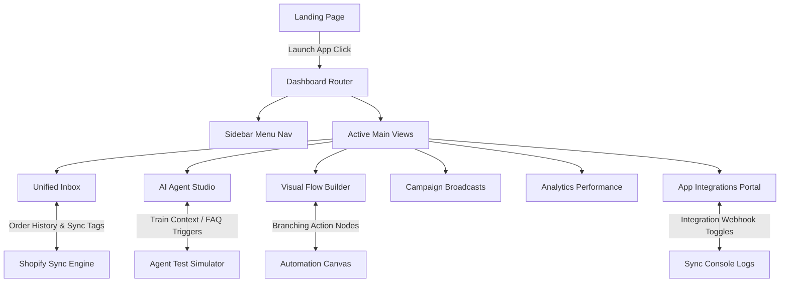

# System Architecture: Zaapi Platform Copy-Clone

This document details the system design, frontend architecture, layout mapping, and state-based routing structures for the Zaapi conversational commerce clone web application.

---

## 1. High-Level Architectural Flow

---

## 2. Components & Layer Responsibilities

### 2.1 Router Layer (`App.jsx`)
* **State Management**: Controls high-level navigation view (`'landing'` or `'dashboard'`) and sub-view state mapping (`'inbox'`, `'ai-agent'`, `'flow-builder'`, etc.).
* **Dark Mode Registry**: Syncs class toggles on `document.body` to adjust variable color themes dynamically between the landing page and app.

### 2.2 Visual Presentation Layer (`LandingPage.jsx`)
* **Responsive Components**: Custom structural grid layouts adapting to Mobile, Tablet, and Desktop.
* **Continuous Marquee**: Continuous keyframe CSS translations displaying active channel support tags (WhatsApp, Instagram, etc.).
* **Dynamic Content Showcase**: Tab navigation showing real-time HTML snapshots representing actual app mock metrics.

### 2.3 Dashboard Application Views (`views/Dashboard/`)
* **Unified Inbox**: Split column layout managing chat filters, conversations, automated simulators, and CRM right-sidebar updates.
* **AI Agent Studio**: Multi-pane config forms training context variables, creating Q&A records, and testing triggers in an inline mock sandbox chat.
* **No-Code Flow Builder**: Positioned node layout on grid backdrops with svg connecting lines.
* **Broadcasts Panel**: Send queue setups enabling variables mapping (`{{customer_name}}`) and dispatch progression meters.
* **Analytics**: HSL styled column graphs representing real-time metric indicators.
* **Integrations**: Sync switches feeding status updates directly to live debug logs.

---

## 3. Data Flow & Event Pipeline
* **Mock Latency Pipeline**: Automated chatbot responses and integrations triggers rely on simulated asynchronous delays (`setTimeout`) ranging from 1.2s to 2.0s to match real API latencies.
* **Tag Modification Pipeline**: State updates propagate immediately from CRM tags forms into filtering queues.
