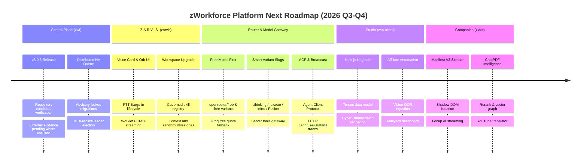

# zWorkforce Total Executive Master Planning (ZWT)

**Updated:** 2026-08-17  
**Status:** Unified Master Engineering & Operations Plan  
**Scope:** Full Project Execution, Control Plane (`zwf`), Content Engine (`zeto`), Voice/Assistant (`zarvis`), Workspace-Agent UX, and Runtime Agent Platform (`hermes` + `spawn`).

---

## 1. Executive Master Architecture

`exec-planning.master.md` is the consolidated source of truth unifying the project lines with real-time agent execution capabilities:

```mermaid
graph TD
    subgraph "Control Plane (zWorkforce Core / zwf)"
        ZWF_API["zWorkforce API & Auth Gateway"]
        ZWF_DB["PostgreSQL / SQLite Durable Repository"]
        ZWF_QUEUE["Distributed Transactional & Idempotent Queue"]
        ZWF_OUTBOX["Reliable Outbox Worker (X-Delivery-ID)"]
        ZWF_POLICY["RBAC / Scopes / Secret Vault / Audit Chain"]
    end

    subgraph "Workspace Agent Experience"
        PROJECTS["Projects + Durable Conversations"]
        CONTEXT["Context Budget + Compaction"]
        SIDECAR["Review / Artifacts / Subagent Trace"]
        SANDBOX["Scoped Local Sandbox + Git Worktrees"]
        COMMANDS["Slash Commands + Task Composer"]
    end

    subgraph "Voice & Assistant Gateway (zarvis)"
        ZARVIS_VOICE["Z.A.R.V.I.S. Voice Card & PTT Stream"]
        ZARVIS_ORB["Animated Voice State & Waveform UI"]
        ZARVIS_ORCH["Session & Task Orchestrator"]
        ZARVIS_CONTRACTS["Z.A.R.V.I.S. Typed Interfaces & Event Bus"]
        ZARVIS_SKILLS["Governed Skill Lifecycle"]
    end

    subgraph "Autonomous Production Engine (zeto)"
        ZETO_CYCLE["IDEATE → GENERATE → WRITE → APPROVE → PUBLISH → MONITOR → LEARN"]
        ZETO_MODES["PRODUCTION | OPS | OPTIMIZE | REVIEW"]
        ZETO_MEDIA["Multi-platform Content & Media Adapters"]
        ZETO_RESEARCH["Skywork-style Deep Research & A2A Interoperability"]
    end

    subgraph "Runtime Agent & Model Layer (Hermes + Spawn)"
        HERMES["Hermes Agent Engine"]
        SPAWN["OpenRouter Spawn CLI + Bun Runtime"]
        SKILLS["Repository + Runtime Skills"]
        MODELS["Dynamic Model Provider Pool"]
        A2A_BUS["Agent2Agent (A2A) Discovery & Context Bus"]
    end

    PROJECTS --> ZWF_API
    CONTEXT --> ZWF_DB
    SIDECAR --> ZWF_DB
    SANDBOX --> ZWF_POLICY
    COMMANDS --> ZARVIS_ORCH
    ZWF_API <--> ZARVIS_VOICE
    ZARVIS_ORCH --> ZARVIS_SKILLS
    ZWF_QUEUE <--> ZETO_CYCLE
    ZWF_POLICY <--> HERMES
    HERMES <--> SKILLS
    HERMES <--> SPAWN
    SPAWN <--> MODELS
    ZETO_RESEARCH <--> A2A_BUS
```



---

## 2. Global Definition of Complete (DoD)

A capability or module is only marked complete when all criteria are satisfied:
1. **Zero Placeholders**: Production-grade implementation without mock stubs.
2. **Tenant Isolation**: All database queries, conversations, memory lookups, artifacts, workspace grants and vector joins enforce strict tenant boundaries.
3. **Secret Isolation**: Provider credentials remain server-side; browser/static code never receives upstream secrets.
4. **Durable State Transitions**: Mutations are transactional and state transitions persist in repository storage.
5. **Idempotency & Fencing**: At-least-once deliveries deduplicate using stable occurrence keys and delivery IDs.
6. **Audit & Provenance**: Tamper-evident logs, artifact hashes, skill versions and workspace actions retain provenance.
7. **Bounded Local Execution**: Workspace/file/command access is allowlisted, path-safe, time/resource bounded and cancellation-aware.
8. **Approval Safety**: Browser actions, shell/file mutations, skill authority expansion and production side effects cannot bypass explicit policy/approval.
9. **Comprehensive Test Suite**: Unit, integration, PostgreSQL recovery drills, provider fakes, static/security checks and affected package suites pass.
10. **Release Evidence**: CI evidence and external production evidence remain explicitly separated.

---

## 3. Subsystem Breakdown & Execution Plans

### 3.1 Control Plane: `zWorkforce` (`zwf`)
- **Canonical Reference**: [`exec-planning-zwf.md`](exec-planning-zwf.md)
- **Status**: Production Release Candidate `v3.0.3`
- **Key Modules**:
  - `zworkforce/api.py`: Authenticated REST & WebSocket endpoints.
  - `zworkforce/database.py`: PostgreSQL / SQLite compatible durable storage.
  - `zworkforce/queue.py`: Transactional lease-expiry distributed task queue.
  - `zworkforce/outbox.py`: `X-ZWorkforce-Delivery-ID` reliable message dispatch.
  - `zworkforce/policy.py`: Deny-by-default mutating tool permissions.

### 3.2 Voice & Assistant Gateway: `Z.A.R.V.I.S.` (`zarvis`)
- **Canonical Reference**: [`exec-planning-zarvis.md`](exec-planning-zarvis.md)
- **Status**: Active Feature Delivery
- **Key Modules**:
  - `packages/zarvis/apps/zvoice`: Low-latency realtime audio streaming.
  - `zworkforce/static/index.html` & `app.js`: Interactive dashboard voice card.
  - shared push-to-talk/browser-safe voice client.
  - `packages/zarvis/services/zarvis-orchestrator`: command, agent and runtime skill orchestration.
  - `packages/zarvis/docs/architecture/skills-agents.md`: agent registry and execution mode contracts.

### 3.3 Production Content Engine: `Zeto` (`zeto`)
- **Canonical Reference**: [`exec-planning-zato.md`](exec-planning-zato.md)
- **Status**: Production Release Target
- **Key Modules**:
  - Full Content Lifecycle: `IDEATE → GENERATE → WRITE → APPROVE → SCHEDULE → PUBLISH → MONITOR → LEARN`.
  - Operating Model: `ROLE → INPUTS → MODES → CONSTRAINTS → OUTPUT → SELF-CHECK → EVIDENCE → OPTIMIZE`.
  - Multi-Platform Publisher: safe adapter pipelines with rollback and audit trails.

### 3.4 AI Studio & Video Rendering: `zsp-aitool`
- **Canonical Reference**: [`exec-planning.zsp-aitool.md`](exec-planning.zsp-aitool.md)
- **Status**: Monorepo Integrated (`packages/zsp-aitool`, Port `:3005` / `studio.zeaz.dev`)
- **Key Modules**:
  - Presentation & Studio UI: Next.js 15.5 App Router + Tailwind CSS dashboard.
  - HyperFrames Video Studio: multi-scene video generation, render queue, and background worker recovery.
  - Affiliate Intelligence & Vision OCR: Shopee OpenAPI product ingestion and image text extraction.
  - Data & Storage: PostgreSQL schema with strict tenant isolation requirements.

### 3.5 AI Browser Companion: `zider`
- **Canonical Reference**: [`exec-planning.zider.md`](exec-planning.zider.md)
- **Status**: Manifest V3 Production Target (`packages/zider`, Gateway Port `:8085`)
- **Key Modules**:
  - Extension Architecture: Shadow DOM isolated sidebar, service worker background orchestrator, and selection toolbar.
  - Multi-Model Router: SSE streaming, single chat, Group AI multi-model comparison, and OpenRouter fallback.
  - Document & Media Engines: ChatPDF tenant vector indexing, YouTube transcript extraction, and real-time translation.

### 3.6 Security & Vulnerability Remediation Loop: `zred-team`
- **Canonical Reference**: [`exec-zred-team.md`](exec-zred-team.md)
- **Status**: Active Continuous Security Hardening
- **Key Modules**:
  - Loop: `DISCOVER → TRIAGE → VALIDATE → ROOT-CAUSE → PATCH → TEST → REGRESSION TEST → SECURITY REVIEW → RE-SCAN`.
  - Boundaries: zero raw secret leakage, SSRF filtering, salted API tokens, bounded tool execution.

### 3.7 Multi-Model Router & Enterprise Gateway: `router` (Free Model First)
- **Canonical Reference**: [`exec-planning-router.md`](exec-planning-router.md)
- **Status**: Active Gateway & Open WebUI Integration (`:3080` / `chat.zeaz.dev`)
- **Key Modules**:
  - Unified OpenAI Router: server-side provider key vault and rate limit protection (`/v1/chat/completions`).
  - **Free Model First Priority**: Default routing dispatches to `openrouter/free` and explicit `:free` variants (`meta-llama/llama-3.3-70b-instruct:free`, `deepseek/deepseek-r1:free`, `google/gemini-2.0-flash-lite:free`, `qwen/qwen-2.5-coder-32b-instruct:free`), falling back to Groq free tier and local edge models before paid escalation.
  - OpenRouter Multi-Provider Failover: dynamic routing across 600+ models with automatic failover to ultra-fast Groq endpoints.
  - Smart Variant Slugs: `:free` zero-cost tier, `:thinking` reasoning, `:exacto` tool calling, `:nitro` speed tier, `:online` web grounding, Pareto coding score routing, and Fusion multi-model deliberation.
  - OpenRouter Server Tools: `web_search`, `web_fetch`, `shell`, `apply_patch`, `advisor` (verification), and `subagent` (delegation).
  - Multimodal Video & Media API: text-to-video, image-to-video, reference-to-video, and asynchronous webhook delivery.
  - Privacy & ZDR Governance: data policy enforcement, Zero Data Retention header injection (`zdr: true`), prompt injection regex patterns, and sovereign AI regional routing allowlists.
  - Enterprise Observability: OpenRouter Broadcast trace forwarding to OTLP Collector, Langfuse, Grafana Cloud, Arize AX, and S3.


### 3.8 Runtime Agent Platform: `Hermes Agent` & `Spawn`
- **Status**: Repository integration line; external host installation/runtime evidence is not implied by repository state.
- **Key Components**:
  - Hermes agent runtime integration.
  - Spawn CLI via Bun runtime.
  - master automation under `scripts/install/`.
  - provider credentials loaded dynamically from approved secret references.

### 3.9 Workspace-Agent Upgrade

- **Canonical Reference**: [`exec-planning-skywork.md`](exec-planning-skywork.md)
- **Research Map**: [`../docs/SKYWORK-CHANGELOG-REVERSE-ENGINEERING.md`](../docs/SKYWORK-CHANGELOG-REVERSE-ENGINEERING.md)
- **Status**: Active Implementation
- **Purpose**: add durable projects/conversations, context visibility/compaction, artifact/review/subagent sidecar, scoped local sandbox/worktrees, command registry, governed skill lifecycle, browser-use contracts, notifications and FinOps preflight without creating parallel control-plane primitives.

Current delivered foundation includes:

- governed Z.A.R.V.I.S. runtime skill active-version selection;
- immediate resolution of installed enabled skills;
- enable/disable and rollback foundations;
- safe system-skill auto-update inside the authorized capability envelope;
- rejection of silent tool-capability expansion, mutability escalation or approval weakening;
- durable tenant-scoped projects and conversations with ordered messages;
- OpenRouter Agent SDK patterns: Human-in-the-Loop (HITL) approval gates, Doom-Loop detection, lifecycle hooks, and long-horizon execution bounds;
- OpenCode ACP (Agent Client Protocol) and pre-mutation Snapshot & Undo engine.

## 4. Feature Upgrade & Next Milestones Roadmap



---

## 5. Complete Skills Matrix

Core skill categories remain:

| Category | Skill / capability | Primary action |
| :--- | :--- | :--- |
| Security & Governance | `zworkforce-secure-editing` | Scoped code modifications preserving tenant boundaries and secret isolation. |
| Security & Governance | `zworkforce-policy-audit` | Audit RBAC, scopes, SSRF filters, approvals and policy. |
| Security & Governance | `zworkforce-artifact-provenance` | Checksums, SBOMs, image digests and release bundles. |
| Architecture & Reliability | `zworkforce-workflow-design` | Durable DAG workflows, occurrence keys, idempotency and retries. |
| Architecture & Reliability | `zworkforce-postgres-recovery` | Schema migrations and disaster-recovery verification. |
| Architecture & Reliability | `zworkforce-incident-response` | Outage triage, containment, health probes and recovery. |
| Voice & Orchestration | `zworkforce-zarvis-contracts` | Z.A.R.V.I.S. contracts and package validation. |
| Voice & Orchestration | `zworkforce-zarvis-runtime-orchestration` | Multi-agent handoffs, continuous execution, capability policy and supervision. |
| Voice & Orchestration | `zworkforce-zarvis-voice-ui` | Realtime audio, PTT, orb states and voice BFF. |
| Model Gateway & Tools | `zworkforce-mcp-integration` | MCP 2026-07-28 stateless tools, tasks, workflows, and memory endpoint. |
| Model Gateway & Tools | `zworkforce-acp-protocol` | Agent Client Protocol (ACP) JSON-RPC standard for IDE & desktop agent integration. |
| Model Gateway & Tools | `zworkforce-ecosystem-cookbooks` | Groq, Liquid AI LFM, Gemini, OpenAI, and Llama cookbook pattern adapters. |
| Plugins & Connectors | `zworkforce-universal-plugins` | Universal plugin packaging (`.codex-plugin/plugin.json`), MCP Apps UI, and marketplace catalog. |
| Plugins & Connectors | `zworkforce-omnichannel-connectors` | Social (Facebook, IG, TikTok, YouTube, X, LinkedIn) & Provider Shop (Shopee, TikTok Shop, Meta Commerce). |
| Agent Personas | `oh-my-opencode-specialists` | Specialist personas (`CodeReviewer`, `TestArchitect`, `SecurityAuditor`, `TechLead`) on Free Models. |
| Agent Lifecycle & Safety | `zworkforce-safety-hooks` | Pre/post tool execution safety guards (`branch-guard`, `secret-guard`, `destructive-guard`). |
| Knowledge & Prompting | `zworkforce-llm-wiki-patterns` | Structured LLM wiki knowledge compounding and pre-mortem execution templates. |
| Ledger & Web3 Provenance | `zworkforce-solana-notarization` | Content hash notarization and agent task attestation on Solana ledger. |
| Intelligence & Memory | `zworkforce-rag-curation` | Tenant-scoped memory, embeddings, and Rerank API precision filters. |
| Intelligence & FinOps | `zworkforce-finops-optimization` | Cost/quality routing, budgets, token analytics, and chargeback. |
| Platform | `zworkforce-github-operations` | PR lifecycle, checks, security runs and release operations. |
| Workspace | workspace sandbox/worktree adapter | Scoped local project execution with explicit write/command authority. |
| Workspace | command/context layer | Context budget, compaction, slash commands and task continuity. |
| Workspace | execution sidecar | Artifacts, review state, subagent/tool timeline and next actions. |

---

## 6. Verification & Validation Protocol

```bash
# 1. Compile and Unit Tests
python3 -m compileall -q zworkforce tests scripts
PYTHONPATH=. python3 -m unittest discover -s tests -v

# 2. System Doctor & Policy Audit
zworkforce doctor

# 3. PostgreSQL Regression
PYTHONPATH=. python3 -m unittest tests/test_v3_postgres.py -v

# 4. Z.A.R.V.I.S. / workspace skill runtime
pnpm --dir packages/zarvis install --frozen-lockfile
pnpm --dir packages/zarvis peers check
pnpm --dir packages/zarvis test
pnpm --dir packages/zarvis audit --audit-level high

# 5. Master Hermes & Skills Dry Run
./scripts/install/install_hermes_full_stack_master.sh --dry-run

# 6. Release consistency
python3 scripts/verify_release.py --expected 3.0.3
```

Production readiness remains governed by `docs/PRODUCTION-EVIDENCE.md`; repository tests do not substitute for external environment evidence.
