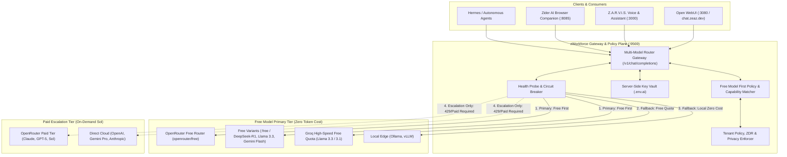

# zWorkforce Multi-Model Router & Gateway Execution Plan (exec-planning-router)

**Updated:** 2026-08-17  
**Status:** Active Execution Plan  
**Scope:** `zworkforce` Model Router, OpenRouter Integration, Open WebUI Gateway, and Provider Privacy/Failover Policies  
**Parent Framework:** [`exec-planning-master.md`](exec-planning-master.md) & [`../ROADMAPS.md`](../ROADMAPS.md)

---

## 1. Executive Summary & Objectives

The zWorkforce Multi-Model Router is the central gateway providing unified OpenAI-compatible routing (`http://api:9569/v1` and Open WebUI on `:3080`) across local and cloud intelligence providers (Anthropic, OpenAI, Google, DeepSeek, Groq, Meta, Mistral, Moonshot, and OpenRouter's 600+ model catalog) with an absolute **Free Model First** dispatch policy.

### Key Objectives:
1. **Free Model First Priority (Zero-Cost Inference)**: All routine tasks, interactive chat, code searches, summarization, and draft workflows dispatch to OpenRouter Free Models (`openrouter/free`, `meta-llama/llama-3.3-70b-instruct:free`, `deepseek/deepseek-r1:free`, `google/gemini-2.0-flash-lite:free`, `qwen/qwen-2.5-coder-32b-instruct:free`) and Groq free quotas before consuming paid credits.
2. **Zero Secret Leakage**: Provider credentials and management tokens remain strictly server-side; client UIs and extensions never receive raw API keys.
3. **Dynamic Provider Fallback & Load Balancing**: Multi-stage waterfall failover: `openrouter/free` → Groq Free Tier → Local Edge (Ollama) → Paid Escalation (Sol tier).
4. **Privacy & Data Governance**: Strict adherence to tenant boundaries, Zero Data Retention (ZDR) requirements, data training policies, and allowed provider allowlists.
5. **Interactive Enterprise Surface**: Seamless integration with Open WebUI (`zworkforce-open-webui`), Code Artifacts engine, and RAG semantic knowledge ingestion.

---

## 2. Router Architecture & Data Flow (Free Model First)



---

## 3. Work Breakdown Structure (WBS) & Implementation Milestones

### Phase 1: Core Gateway & Open WebUI Foundation (Completed)
- [x] **Containerized Control Center**: Open WebUI deployed via `compose.open-webui.yml` on port `3080`.
- [x] **Database User & RBAC Setup**: Admin role and full permissions provisioned for authorized operational emails (`cvsitem@gmail.com`, `sea@zeaz.dev`, `sea@cvs.in.th`, `seaza@msn.com`).
- [x] **OpenAI Compatible Endpoint**: Routing layer configured to point to zWorkforce Multi-Model Router (`http://api:9569/v1`).
- [x] **Code Artifacts & Interactive Preview**: Interactive HTML, React, and SVG artifact rendering enabled.

### Phase 2: Upstream Provider & Key Resilience (Active)
- [x] **OpenRouter Dynamic Provisioning**: Management key provisioning integration to generate and rotate working API keys with zero manual downtime.
- [x] **Groq High-Speed Tier**: Direct integration with Groq API (`gsk_...`) for `llama-3.3-70b-versatile` and `llama-3.1-8b-instant` fallback.
- [ ] **Automated Key Health Heartbeat**: Background task polling upstream auth endpoints every 15 minutes to flag revoked or expired credentials before user impact.
- [ ] **Automated Key Rotation & Infisical Sync**: Trigger alerts and automated rotation hooks via OpenRouter Management API and Infisical when an upstream key incurs repeated 401/403 responses.
- [ ] **Zero Completion Insurance**: Automatic detection of zero-token empty responses with immediate failover to alternative provider/variant without double charging.

### Phase 3: Smart Variant Slugs, Server Tools, ACP & Model Metadata (In Progress)
- [x] **Account-Level Privacy Sync**: Document and maintain compliance for OpenRouter Data Training policies (`Allow free endpoints that train on request data` & `Allow free endpoints that publish prompts`).
- [x] **Allowed Provider Routing**: Complete provider mapping allowlist ensuring zero unintended provider lockouts.
- [ ] **OpenCode Model Metadata & Capability Matrix**:
  - Implement unified `ModelMetadata` schema tracking `capabilities` (`toolcall`, `reasoning`, `temperature`, `interleaved`), `cost` (input, output, cache read/write), and `limit` (context, max output);
  - Dynamic capability filter matching for **Free Model First** routing (verifying `toolcall: true` before dispatching agentic loops to free models).
- [ ] **Agent Client Protocol (ACP) Gateway Integration**:
  - Support bidirectional ACP standard (`@agentclientprotocol/sdk`) over stdio and HTTP/SSE for IDE / client attachments;
  - Real-time `sessionUpdate` streaming for token chunks, tool call execution events, and HITL permission requests.
- [ ] **OpenRouter Smart Variant Slugs (Free First Priority)**:
  - `:free` (Free Models Router primary tier for zero-cost inference);
  - `:thinking` (extended reasoning parameter translation for free DeepSeek-R1, Claude, and OpenAI o-series);
  - `:exacto` & Auto-Exacto (quality-first provider sorting for tool and function calling);
  - `:nitro` (high-throughput low-latency inference routing);
  - `:extended` (large context window models);
  - `:online` (model-agnostic web grounding plugin);
  - Pareto Router (minimum coding score router) & Fusion Router (multi-model deliberation).
- [ ] **Model Migration Specification Alignment**:
  - Claude Opus 5, Claude 5 Sonnet, Claude 4.7/4.6 adaptive thinking, xhigh effort levels, and mid-turn tool mutation support;
  - GPT-5.6 / GPT-5.5 / GPT-5.4 `reasoning.mode`, `reasoning.context`, and phase field parameters.
- [ ] **Server Tools Gateway Integration**:
  - Server-side Web Search (`web_search`) and Web Fetch (`web_fetch`);
  - Sandboxed Shell (`shell`) and Apply Patch (`apply_patch`) for V4A diff edits;
  - Advisor Tool (`advisor`) for compact uncertainty validation;
  - Subagent Tool (`subagent`) for subtask delegation.
- [ ] **Dynamic Prompt Caching**: Header and payload injection for explicit `cache_control` blocks, maximizing cache hit rate across multi-turn sessions.
- [ ] **Global Ecosystem Cookbook Adapters (Free Model First)**:
  - Groq Free Quota Orchestrator (`groq/groq-api-cookbook`): ultra-fast low-latency routing for `llama-3.3-70b-versatile` & `deepseek-r1-distill-llama-70b`;
  - Liquid AI Foundational Models (`Liquid4All/cookbook`): local edge LFM-1B/3B / LFM-Vision integration for resource-bounded nodes;
  - Unified Multimodal & Function Calling (`google-gemini/cookbook`, `openai/openai-cookbook`, `meta-llama/llama-cookbook`);
  - Solana Ledger Audit Anchoring (`solana-developers/solana-cookbook`): immutable content hash notarization on devnet/mainnet.

### Phase 4: Privacy, Guardrails, Safety Hooks & Sovereign Governance (Active)
- [ ] **Agent Lifecycle Hooks & Deterministic Safety Guards** (`yurukusa/claude-code-hooks`, `wasabeef/claude-code-cookbook`):
  - Pre-tool / post-tool execution hooks with deterministic safety gate filters;
  - `branch-guard`: block mutating execution on protected branches (`main`, `master`, `release/*`);
  - `secret-guard` & `destructive-guard`: pre-execution AST scan preventing command injection, `rm -rf`, or plaintext credential egress;
  - `auto-approve-readonly`: zero-friction auto-approval for read-only tools (`grep`, `glob`, `view_file`, `cat`).
- [ ] **Zero Data Retention (ZDR) Enforcement**: Header injection (`HTTP-Referer`, `X-Title`, and `zdr: true`) for enterprise-confidential tenant workloads.
- [ ] **Tenant Token Budget Preflight**: Validate tenant credit and token quotas before forwarding multi-turn large context prompts.
- [ ] **Prompt Injection & Sensitive Info Guardrails**: Regex-based injection detection, custom allowlists, and automatic PII masking/redaction before model egress.
- [ ] **Sovereign AI Routing**: Enforce regional routing constraints to guarantee data resides within designated sovereign boundaries (e.g. EU, US-only).

### Phase 5: Observability, Broadcast & FinOps Telemetry (Forward)
- [ ] **OpenRouter Broadcast Tracing**: Route execution traces to OpenTelemetry Collector, Langfuse, Grafana Cloud, Arize AX, Datadog, and S3 sinks.
- [ ] **Per-Route Latency Histograms**: Track Time-to-First-Token (TTFT) and tokens/sec across Groq, OpenRouter, and Direct providers.
- [ ] **Provider Error Classification**: Real-time tracking of 401 (Auth), 404 (No Endpoint / Data Policy), 429 (Rate Limit), and 503 (Upstream Outage).
- [ ] **FinOps Dashboard & Analytics API**: Programmatic cost accounting, token velocity, cost per completion, and daily savings achieved through intelligent provider routing.

### Phase 6: Universal Plugin Architecture, Tunnel Client & Multi-Agent Framework (Active)
- [x] **Universal Plugin Packaging**: Implement `.codex-plugin/plugin.json` compatible with OpenAI Plugins, Codex, and Claude Code plugin specs.
- [x] **Omnichannel Social & E-Commerce Connectors**: Shopee Open Platform v2, TikTok Shop Seller API, Facebook Commerce, Meta Graph, TikTok Content, YouTube, X, LinkedIn.
- [ ] **Secure Local MCP Tunnel Client Gateway** (`openai/tunnel-client`):
  - Ingress/egress reverse tunnel for connecting private local MCP servers to cloud workforce agents without exposing firewall ports.
- [ ] **Multi-Agent Handoff & Guardrail Protocols** (`openai/openai-agents-python`, `openai/openai-agents-js`):
  - Multi-agent routing with typed input/output validation, context compaction, and deterministic tool call evaluation on zero-cost free model tiers.
- [ ] **MCP Apps UI Standard**: Support `_meta.ui.resourceUri` and `postMessage` JSON-RPC bridge (`ui/*`) for interactive web components in agent conversations.

---

## 4. Verification & Validation Commands

```bash
# 1. Verify Router and Core Services
python3 -m compileall -q zworkforce tests
PYTHONPATH=. python3 -m unittest discover -s tests -v
zworkforce doctor

# 2. Test Open WebUI and Container Health
docker ps --filter "name=zworkforce-open-webui"
curl -fsS http://localhost:3080/health || true

# 3. Test Groq Fast Route
curl -s -X POST https://api.groq.com/openai/v1/chat/completions \
  -H "Authorization: Bearer ${GROQ_API_KEY}" \
  -H "Content-Type: application/json" \
  -d '{"model": "llama-3.3-70b-versatile", "messages": [{"role": "user", "content": "ping"}]}'

# 4. Verify Database Integrity & Open WebUI Users
docker exec zworkforce-open-webui python3 -c "
import sqlite3
conn = sqlite3.connect('/app/backend/data/webui.db')
cur = conn.cursor()
cur.execute('SELECT email, role FROM user;')
print(cur.fetchall())
"
```

---

## 5. Non-Negotiable Invariants

1. **No Provider Secrets in Frontend Code**: API keys must never be returned in client-facing JSON payloads or stored in browser local storage.
2. **Deterministic Failover**: When primary model endpoints return 503 or 429, the router must failover to configured secondary providers without dropping the conversation turn.
3. **Tenant Context Boundary**: Requests originating from one tenant must never share cache, prompt history, or vector embeddings with another tenant.
