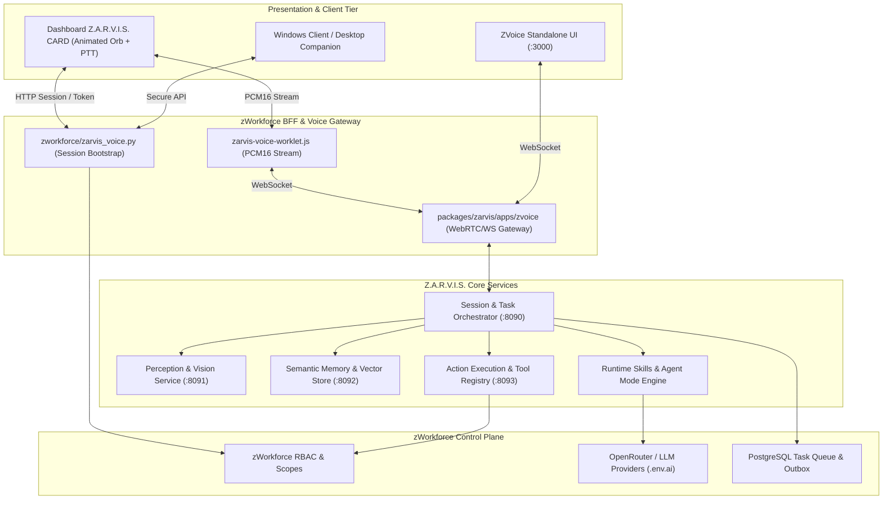

# Z.A.R.V.I.S. Master Execution & Architecture Plan (packages/zarvis)

**Updated:** 2026-08-16  
**Scope:** `packages/zarvis` (Autonomous Assistant Suite, Voice Gateway, Perception/Memory, Task/Action Engine, and Operator Runtime)  
**Parent Framework:** [`exec-planning-master.md`](exec-planning-master.md) & [`../packages/zarvis/AGENTS.md`](../packages/zarvis/AGENTS.md)  
**Branch:** `feat/zarvis-openjarvis-upgrade-plan`

---

## 1. Executive Mission & System Boundary

`packages/zarvis` is the security-first autonomous assistant suite inside `cvsz/zWorkforce`. It integrates real-time voice perception, local action dispatch, memory recall, and proactive scheduled agent workflows while preserving strict tenant isolation and server-side secret boundaries.



---

## 2. Architecture Directives & Security Invariants

1. **Defensive Framing & Zero iFrame Bypass**: ZVoice UI enforces frame defense (`X-Frame-Options: DENY`). The zWorkforce dashboard voice integration connects via a browser-safe shared JavaScript client worklet (`zarvis-voice-worklet.js`) and BFF session token.
2. **Zero Client Secret Exposure**: Upstream speech/LLM tokens, gateway URLs, and provider keys (`OPENROUTER_API_KEY`, etc.) remain in server memory. Clients receive temporary, bounded session tokens.
3. **Explicit Mutation Gate**: Spoken requests, AI decisions, or scheduled triggers are **never treated as implicit approvals** for state-mutating actions. State changes halt until explicit operator authorization is received.
4. **Bounded Continuous & Scheduled Agents**: Scheduled agents are constrained by lease timeouts, heartbeats, concurrency rate limits, pause/kill switches, and persistent audit loggers.
5. **Separation of Skills**: Repository coding skills (`.agents/skills/`) remain separate from product/runtime Z.A.R.V.I.S. skills (`packages/zarvis/skills/`).

---

## 3. Implementation Breakdown by Priority Phase

### P0 — Architecture, Contracts & Boundary Specifications
- [`packages/zarvis/AGENTS.md`](file:///home/cvsz/zworkforce/packages/zarvis/AGENTS.md): Package boundary, security invariants, and coding guidelines.
- [`packages/zarvis/ARCHITECTURE.md`](file:///home/cvsz/zworkforce/packages/zarvis/ARCHITECTURE.md): Multi-service topologies and message flow diagrams.
- [`packages/zarvis/docs/architecture/openjarvis-upgrade-map.md`](file:///home/cvsz/zworkforce/packages/zarvis/docs/architecture/openjarvis-upgrade-map.md): Source-to-target architectural mapping and registry composition.
- [`packages/zarvis/docs/architecture/skills-agents.md`](file:///home/cvsz/zworkforce/packages/zarvis/docs/architecture/skills-agents.md): Canonical skill/agent model and execution matrix.

### P1 — Dashboard Z.A.R.V.I.S. CARD & Voice BFF
- **`zworkforce/static/index.html` & `app.js`**: Interactive voice widget featuring animated orb states (idle, listening, thinking, speaking, error) and transcript displays.
- **`zworkforce/zarvis_voice.py`**: Authenticated BFF session bootstrap proxying to Z.A.R.V.I.S. voice gateway without exposing upstream credentials.
- **Push-To-Talk (PTT)**:
  - Pointer/Touch: Press down to capture, release to commit audio turn.
  - Keyboard: Hold `Space` (when not focusing text inputs) to speak.
  - Barge-in: Speaking while audio playback is active immediately cancels assistant playback.
  - `Escape`: Cancels assistant generation/playback without approving pending mutations.

### P2 — Shared Browser Voice Client Package
- `packages/zarvis/packages/voice-client/`: Reusable browser-safe WebSocket and WebRTC audio streaming package.
  - `audio.js`: Resampling to 16kHz PCM16, float-to-int conversion, jitter buffer management.
  - `ptt.js`: Event listeners for keyboard/pointer interactions.
  - `state.js`: Finite state machine for audio turn synchronization.

### P3 — Core Service Mesh & Autonomous Runtimes
- **`apps/zvoice`**: Fast, lightweight voice gateway supporting Whisper/Deepgram STT, OpenAI/OpenRouter LLMs, and ElevenLabs/Cartesia TTS.
- **`services/orchestrator`**: Session lifecycle manager connecting multimodal sensory inputs to tool decisions.
- **`services/memory`**: Tenant-isolated vector store integrating long-term episodic and semantic memory.
- **`services/actions`**: Safe execution sandbox for shell, web, and internal API mutations.

---

## 4. Operational Resilience & Incident Response (ZARVIS-Incident)

| Severity | Impact | Containment SLA | Automated Actions |
| :--- | :--- | :--- | :--- |
| **SEV-0** | Unbounded tool mutation executed without operator gate or cross-tenant memory leakage. | < 15 min | Kill agent orchestrator process, revoke all active voice session tokens, disable mutating tools. |
| **SEV-1** | STT/TTS pipeline stall, audio latency > 800ms, or WebSocket connection drops. | < 30 min | Fail over speech synthesis to local TTS fallback; route LLM turns to OpenRouter Free tier. |
| **SEV-2** | Memory re-indexing delay or background vision perception frame dropping. | < 2 hr | Throttle perception FPS, restart memory background worker. |

---

## 5. Disaster Recovery & Testing Protocol

```bash
# 1. Validate zWorkforce Root Suite & Voice API
python3 -m compileall -q zworkforce tests
PYTHONPATH=. python3 -m unittest tests/test_zarvis_voice_api.py -v
PYTHONPATH=. python3 -m unittest tests/test_zarvis_package.py -v

# 2. Validate packages/zarvis Workspace
cd /home/cvsz/zworkforce/packages/zarvis
pnpm test || make test
```
