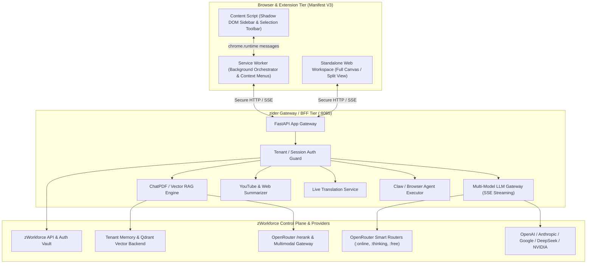

# zider: Full Project Execution, Incident, Disaster Recovery, Evidence & Release Master Plan (ZIDER)

**Updated:** 2026-08-16  
**Package:** `packages/zider` (AI Browser Sidebar, ChatPDF, Summarizer, Multi-Model Group Chat & Web Assistant)  
**Control Plane:** `zWorkforce` (v3.0.3 repository candidate on `main`)  
**Parent Plan:** [`exec-planning.master.md`](exec-planning.master.md)

---

## 1. Executive Mission & System Scope

`zider` is an open-source, full-stack, enterprise-grade AI Sidebar and Browser Companion workspace for `zWorkforce`, inspired by Sider.ai. It delivers multi-model AI chat (GPT-4o, Claude 3.5, Gemini 2.0/3.0, DeepSeek R1/V3, Grok, OpenRouter/Hermes), ChatPDF document intelligence, YouTube and Webpage summarization, live translation, and autonomous browser workflow automation.



---

## 2. Core Directives & Architecture Invariants

1. **Zero Secret Exposure**: The browser extension, content scripts, and web UI never receive provider API keys (`OPENROUTER_API_KEY`, `DEEPSEEK_API_KEY`, etc.). All calls proxy through the authenticated `zider` BFF (`:8085`) and `zWorkforce` control plane.
2. **Manifest V3 Strict Compliance**: Uses background service workers, isolated content scripts, and secure Shadow DOM injection to prevent CSS/DOM pollution on host pages.
3. **Multi-Model Orchestration & Smart Variants**: Supports single chat, Group AI Chat (parallel multi-model compare), SSE streaming, and OpenRouter smart variant slugs (`:thinking`, `:exacto`, `:nitro`, `:online`, `:free`, Pareto router).
4. **High-Precision RAG with Embeddings & Rerank API**: ChatPDF pairs vector embeddings with OpenRouter's `/rerank` API to filter the highest-relevance document chunks before context generation.
5. **Multimodal PDF & Image Intelligence**: Native support for PDF documents and image screenshots with server-side base64 / URL handling and OCR cross-referencing.
6. **Bounded Agent Tool Execution**: Autonomous browser tool runners require explicit user authorization for state-mutating actions (clicks, form submission, file uploads).
7. **Tenant Isolation**: ChatPDF document embeddings, vector chunks, and session memories are tagged with tenant identifiers.

---

## 3. Incident Response & Containment Protocol (ZIDER-Incident)

| Severity | Definition | Containment SLA | Automated Actions |
| :--- | :--- | :--- | :--- |
| **SEV-0** | Direct API key leak in extension bundle or cross-tenant document memory access. | < 15 min | Immediate revocation of exposed key, kill active sessions, rotate BFF tokens, deploy emergency extension patch. |
| **SEV-1** | LLM router failure, SSE streaming deadlock, or ChatPDF vector index corruption. | < 30 min | Failover to fallback free models (`dots-studio/dots-3-note-preview:free`, `meta-llama/llama-3.3-70b-instruct:free`), trigger Qdrant re-index. |
| **SEV-2** | YouTube transcript extraction block or high latency on translation engine. | < 2 hr | Switch YouTube scraper to secondary proxy fallback; degrade gracefully to web summary. |

---

## 4. Disaster Recovery & Durability Standards (ZIDER-DR)

1. **ChatPDF & Vector Storage Recovery**:
   - PDF uploads and document metadata store persistently in PostgreSQL / local storage.
   - Vector embeddings are idempotent: rebuilding the collection from raw documents produces an identical searchable graph.
2. **Session Persistence & Restart Safety**:
   - Active chat histories and multi-model group conversations persist across browser restarts and background worker unloads.
3. **Disaster Recovery Drill**:
   ```bash
   # Test zider server and integration endpoints
   cd packages/zider && make test
   ```

---

## 5. Evidence Ledger & Audit Provenance (ZIDER-Evidence)

All releases of `packages/zider` must document cryptographic evidence in [`../docs/PRODUCTION-EVIDENCE.md`](../docs/PRODUCTION-EVIDENCE.md):
- **Extension Zip SHA-256**: Hash of the packed Manifest V3 extension bundle.
- **Server Image Digest**: GHCR container digest for `zider-server:latest`.
- **Static Assets Security Audit**: Regex check asserting zero hardcoded API keys in `packages/zider/extension/` and `packages/zider/web/`.

---

## 6. Release Verification & Gating Protocol (ZIDER-Release)

Before promoting `packages/zider` to production or publishing extension store updates:

### Pre-Release Checklist
- [ ] **Extension Build & Validation**: `cd packages/zider && npm run build` produces valid Manifest V3 bundles.
- [ ] **Server Lint & Unit Tests**: `cd packages/zider/server && pytest` or `make test` exits `0`.
- [ ] **Security Secret Scan**: Zero secrets present in static assets (`extension/`, `web/`, `dist/`).
- [ ] **Multi-Model Routing Verification**: Test single, Group AI chat, and OpenRouter Free fallback endpoints.
- [ ] **Shadow DOM Isolation Test**: Verify sidebar injection does not leak styles or break host page scripts.

### Release Verification Commands
```bash
# 1. Validate root control plane
python3 -m compileall -q zworkforce tests
PYTHONPATH=. python3 -m unittest discover -s tests -v

# 2. Validate zider server and extension
cd /home/cvsz/zworkforce/packages/zider
make build
make test
```
