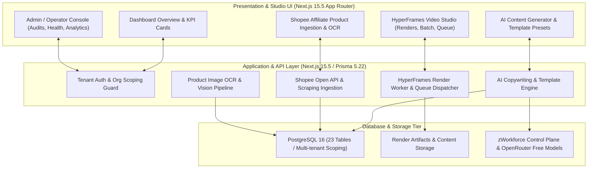

# zsp-aitool Execution & Production Readiness Master Plan

**Updated:** 2026-08-16  
**Package:** `packages/zsp-aitool` (Thai-First Shopee Affiliate AI Studio & HyperFrames Video Generator)  
**Agent Identity:** Arin  
**Local Origin:** `http://127.0.0.1:3005`  
**Public Edge:** `https://studio.zeaz.dev`  
**Control Plane:** `zWorkforce` (v3.0.3 repository candidate on `main`)  
**Parent Plan:** [`exec-planning.master.md`](exec-planning.master.md)

---

## 1. Product Mission & Architectural Scope

`packages/zsp-aitool` is an enterprise-grade, Thai-first AI content generation, Shopee affiliate intelligence, and HyperFrames video rendering platform.



---

## 2. Hard Security & Operational Invariants

1. **Port & Ingress Invariant**: Production port `3001` remains locked (`STUDIO_LOCAL_URL=http://127.0.0.1:3001`). Cloudflare 403 challenge at `studio.zeaz.dev` is treated as `WARN`, not application failure.
2. **Zero Client Secret Exposure**: `DATABASE_URL`, `OPENROUTER_API_KEY`, Shopee partner secrets, and Cloudflare tokens never leak to browser bundles or client-side JSON.
3. **No Internal Path Leaks**: Never expose `/var/lib`, local render `outputPath`, internal filesystem paths, or unmasked stack traces in UI responses.
4. **XSS Defense**: `dangerouslySetInnerHTML` is strictly prohibited for user-controlled strings.
5. **Restricted Shell / Systemctl Execution**: No frontend UI element or API endpoint may execute arbitrary shell commands or control `systemctl` daemons directly.
6. **Shopee Affiliate Compliance**:
   - Strictly enforces affiliate disclosure tags on AI generated copy.
   - Zero scraping of private user data or circumventing login walls/anti-bot gates.

---

## 3. Database Schema Topology (23 Prisma Tables)

| Entity Category | Prisma Tables | Purpose |
| :--- | :--- | :--- |
| **Auth & Multi-Tenancy** | `User`, `Organization`, `OrgMembership`, `UserSetting` | Tenant isolation, team RBAC, and localized user preferences. |
| **Product & Commerce** | `Product`, `ProductImage`, `ProductDuplicateGroup`, `AffiliateLink`, `SimilarProduct` | Catalog management, affiliate link tracking, and similarity clustering. |
| **AI Content Factory** | `ContentGeneration`, `ContentTemplate`, `PromptPreset`, `PlatformPost`, `AIContentQueueJob` | Copywriting presets, batch generation queue, and social post scheduling. |
| **Vision & Extraction** | `OCRJob`, `ShopeeAffiliateIngestion`, `ShopeeAffiliateSocialDraft`, `CsvImportJob` | Optical character recognition, product image text parsing, and CSV ingestion. |
| **Video Engine** | `HyperFrameRenderJob`, `HyperFrameRenderShare`, `FeedbackSubmission`, `APIUsageLog` | Video render jobs, shareable previews, user feedback, and token usage audit logs. |
| **Migrations** | `_prisma_migrations` | Versioned schema migration tracking. |

---

## 4. UI Phase Roadmap & Implementation Status

### Phase 1 — Professional App Shell & Studio Dashboard (Complete)
- Responsive Thai-first layout (`AppLayout.tsx`, `Sidebar.tsx`, `Header.tsx`, `MobileNav.tsx`).
- Live KPI overview cards, product quick-action banners, and zero raw JSON rendering.

### Phase 2 — Admin Panel & Operator Guard (Complete)
- Routes: `/dashboard/admin`, `/dashboard/admin/users`, `/dashboard/admin/products`, `/dashboard/admin/renders`, `/dashboard/admin/audit-logs`.
- Gated behind `ADMIN_PANEL_ENABLED=true` with masked email/PII displays and zero server secret leakage.

### Phase 3 — HyperFrames Video Production & Queue Operations (Complete)
- Routes: `/dashboard/hyperframes`, `/dashboard/hyperframes/renders`, `/dashboard/hyperframes/batch`, `/dashboard/hyperframes/ops/queue`.
- Background worker watchdog, render queue metrics, and automated stale-job recovery.

### Phase 4 — OpenRouter Multimodal Video Generation & Webhook Dispatch (Forward)
- **Direct Video Generation API**: Text-to-Video and Image-to-Video generation using OpenRouter hosted video models for short affiliate product teasers.
- **Frame & Reference Conditioning**: First-frame / last-frame image anchors and reference images for character/product brand consistency.
- **Asynchronous Webhook Ingestion**: Receive video render callbacks at `/api/webhooks/openrouter-video` with HMAC signature validation and auto-linking to `HyperFrameRenderJob`.
- **Preset-Enhanced Image & Thumbnail Studio**: LLM prompt expansion pairing with image generation server tools for high-CTR Shopee product cover art.

---

## 5. Incident Response & Disaster Recovery (ZSP-ZIDER)

| Severity | Definition | Containment SLA | Automated Actions |
| :--- | :--- | :--- | :--- |
| **SEV-0** | Database credential exposure or cross-organization product data access. | < 15 min | Kill active sessions, revoke compromised credentials, isolate affected tenant ID. |
| **SEV-1** | HyperFrames render queue freeze or OCR worker failure. | < 30 min | Re-queue stalled jobs with `scripts/hyperframes/recover-stale-jobs.ts`, trigger worker restart watchdog. |
| **SEV-2** | Shopee ingestion latency or Cloudflare edge challenge block. | < 2 hr | Fall back to manual CSV import workflow and local edge testing. |

---

## 6. Required Verification Suite

Run the full verification pipeline after any modifications:

```bash
cd /home/cvsz/zworkforce/packages/zsp-aitool

# 1. Package integrity & schema validation
python3 -m json.tool package.json > /dev/null
npm run prisma:generate
npx prisma validate

# 2. Typecheck & Vitest test suite (355 tests)
npm run typecheck
npm run test

# 3. Production build & health probe
npm run build
npm run health
```
