# zWorkforce Production Readiness Execution Plan (zwf Core)

**Updated:** 2026-08-18  
**Candidate:** `v3.0.3` repository candidate on `main`  
**Baseline main:** `4f8935759bda02a89bd0bc2eeb5b9a3ab6777045`  
**Parent Framework:** [`exec-planning-master.md`](exec-planning-master.md) & [`../AGENTS.md`](../AGENTS.md)

This is the production-readiness execution plan for the root `zWorkforce` control plane. It defines required validation gates, state invariants, secret safety, PostgreSQL operations, and durable release proofs before tagging `v3.0.3`.

The durable evidence ledger for this candidate is [`../docs/PRODUCTION-EVIDENCE.md`](../docs/PRODUCTION-EVIDENCE.md). Any external deployment stage without cryptographic proof remains `PENDING EXTERNAL EVIDENCE`.

---

## 1. Repository Baseline & Release Context

- **Release Status**: Full Final Release `v3.0.2` remains the stable release; the `v3.0.3` repository candidate has been merged to `main` and remains evidence-gated before immutable tag creation.
- **Target Surfaces**:
  - `zworkforce/` Python control plane, durable database repository, distributed queue, outbox engine, and API layer.
  - `packages/zarvis/` Voice gateway, session/task orchestrator, and multimodal runtime.
  - `packages/zeto/` Autonomous production content lifecycle engine.
  - `packages/zider/` Manifest V3 AI sidebar, ChatPDF, and multi-model router.
  - `ZWorkforceClient/` Native Windows WinUI desktop client.
- **Provider Credentials**: Loaded dynamically from `.env.ai`.
- **Release Boundary**: Repository CI evidence does not substitute for external PostgreSQL/PITR, identity, provider, storage, observability, Windows signing, rollout, or GO/NO-GO evidence required by `docs/PRODUCTION-EVIDENCE.md`.

---

## 2. Non-Negotiable Architecture Invariants

1. **Tenant Isolation**: Memory IDs, document embeddings, vector joins, and database rows are tenant-scoped. Cross-tenant collisions are strictly rejected.
2. **Deterministic Idempotency**: Scheduler ticks, event occurrences, and workflow steps maintain stable idempotency keys. Re-running after a crash returns the existing occurrence rather than creating duplicate side-effects.
3. **At-Least-Once Delivery & Deduplication**: Queue workers and outbox delivery send `X-ZWorkforce-Delivery-ID`. Consumers must deduplicate deliveries because crashes following successful network calls are valid delivery windows.
4. **Server-Side Secret Containment**: Browser extension clients, static assets, and client-facing endpoints never receive raw API keys or database connection strings.
5. **No Mock Providers in Production**: Production environments reject mock or dummy model adapters. Real credentials must be injected via secure environment variables or vault references.
6. **Bounded Mutations & Authorization**: State-changing tool executions default to deny-by-default and require explicit operator or role-scoped authorization.
7. **Advisory-Locked Schema Evolution**: PostgreSQL migrations execute within session-level advisory locks to prevent concurrent initialization race conditions.

---

## 3. Core Control Plane Subsystems

```mermaid
graph TD
    subgraph "zWorkforce Control Plane"
        API["REST & WebSocket API (:9569)"]
        Auth["JWT / API Key / Proxy Identity"]
        Queue["Distributed Transactional Task Queue"]
        Outbox["Reliable Outbox Worker"]
        DB["Durable Database Layer (PostgreSQL / SQLite)"]
        Vault["Server-Side Secret Store (.env.ai)"]
    end

    subgraph "Integrated Packages & Clients"
        Zarvis["packages/zarvis (Voice & Actions)"]
        Zeto["packages/zeto (Content Factory)"]
        Zider["packages/zider (Sidebar Companion)"]
        WinUI["ZWorkforceClient (WinUI Desktop)"]
    end

    API --> Auth
    Auth --> DB
    API --> Queue
    Queue --> DB
    DB --> Outbox
    API --> Vault

    Zarvis <--> API
    Zeto <--> API
    Zider <--> API
    WinUI <--> API
```



---

## 4. Operational Recovery & Disaster Protocol

### 4.1 PostgreSQL Point-In-Time Recovery (PITR)
- **Target Metrics**: RPO $\le 5$ minutes, RTO $\le 30$ minutes.
- **Repository Verification**:
  ```bash
  PYTHONPATH=. python3 -m unittest tests/test_v3_postgres.py -v
  ```
- **Production Readiness**: A passing repository test is regression evidence only. Record managed/external backup, restore, PITR target, observed RPO/RTO, and durable artifact references in `docs/PRODUCTION-EVIDENCE.md` before claiming production recovery readiness.

### 4.2 Outbox & Queue Recovery
- Unclaimed or expired task leases are re-queued automatically after timeout.
- Unsent outbox events re-attempt delivery with exponential backoff while retaining their original `X-ZWorkforce-Delivery-ID`.

---

## 5. Required Release Verification Pipeline

Before committing candidate tags or publishing release manifests:

```bash
# 1. Bytecode compilation & unit test suite
python3 -m compileall -q zworkforce tests
PYTHONPATH=. python3 -m unittest discover -s tests -v

# 2. System doctor health probe
zworkforce doctor

# 3. Static asset security check (Assert zero secrets)
python3 -m unittest tests/test_static_assets.py -v

# 4. Master full-stack dry run
./scripts/install/install_hermes_full_stack_master.sh --dry-run
```
