# zWorkforce Total Executive Master Planning (ZWT)

**Updated:** 2026-08-28  
**Status:** Enterprise-Grade Production Release Ready (`v3.0.4`)  
**Scope:** Single Unified Monorepo, Control Plane (`zwf`), Realtime Voice & Assistant (`zarvis`), Content Engine (`zeto`), Omnichannel Commerce OS (`zok`), AI Browser Companion (`zider`), AI Studio & Video Rendering (`zsp-aitool`), Microservices (`services/*`), Frontend Apps (`apps/*`), and Runtime Platform (`hermes` + `spawn`).

---

## 1. Executive Master Architecture

`exec-planning.master.md` is the consolidated source of truth unifying all product suites and microservices into a single governed control plane:

```mermaid
graph TD
    subgraph "Control Plane (zWorkforce Core / zwf)"
        ZWF_API["zWorkforce API & Auth Gateway (Port 9569)"]
        ZWF_DB["PostgreSQL / SQLite Durable Repository"]
        ZWF_QUEUE["Distributed Transactional & Idempotent Queue"]
        ZWF_OUTBOX["Reliable Outbox Worker (X-Delivery-ID)"]
        ZWF_POLICY["RBAC / Scopes / Secret Vault / Audit Chain"]
    end

    subgraph "Voice & Assistant Gateway (zarvis)"
        ZARVIS_VOICE["Z.A.R.V.I.S. Realtime Voice Gateway (Port 8450)"]
        ZARVIS_PTT["Single-Click & Hold-to-Talk Web Audio PCM16"]
        ZARVIS_ORB["Animated Voice State HUD & Level Visualizer"]
        ZARVIS_ACTION["Action Gateway (Port 8098) & Proactive Daemon (:8099)"]
    end

    subgraph "Second Brain & Autonomous Content (Javis + Zeto)"
        SECOND_BRAIN["Interactive Knowledge Graph & Semantic Wiki"]
        ZETO_CYCLE["IDEATE → GENERATE → WRITE → APPROVE → PUBLISH → LEARN"]
        ZETO_MEDIA["Multi-platform Content & Media Adapters"]
    end

    subgraph "Conversational Commerce & Inbound (zok)"
        ZOK_ROUTER["LINE OA, WhatsApp Cloud API & Thai Dialect Router"]
        ZOK_SHOP["Shopee & TikTok Shop Sync + Shopify CRM Outbox"]
        ZOK_STORE["Dual-Store PostgreSQL + JSON Rollback Protection"]
    end

    subgraph "Browser AI & Media Automation (zider + Kyle Nguyen Hub)"
        ZIDER_EXT["AI Browser Companion & Shadow DOM Sidebar"]
        MEDIA_STUDIO["AI Watermark Remover & Veo/Vids Batch Video Engine"]
        CANVA_AUTO["Canva Design Suite & Multi-Tab Automation Loop"]
    end

    subgraph "Unified Microservices & Apps Monorepo"
        SERVICES_GATEWAY["services/ai-gateway & services/agent-orchestrator"]
        SERVICES_ZC["services/zc (Interactive Coder) & z-provisioning"]
        APPS_CONSOLE["apps/zarvis-console, apps/zchat, apps/zeaz-web"]
        CONTRACTS["packages/contracts (Shared Type Schemas)"]
    end

    ZWF_API <--> ZARVIS_VOICE
    ZARVIS_VOICE --> ZARVIS_ACTION
    ZWF_QUEUE <--> ZETO_CYCLE
    ZWF_DB <--> SECOND_BRAIN
    ZWF_API <--> ZOK_ROUTER
    ZOK_ROUTER --> ZOK_STORE
    ZWF_POLICY <--> ZIDER_EXT
    ZIDER_EXT --> MEDIA_STUDIO
    SERVICES_GATEWAY <--> CONTRACTS
    APPS_CONSOLE <--> ZWF_API
```



---

## 2. Global Definition of Complete (DoD)

A capability or module is only marked complete when all criteria are satisfied:
1. **Zero Placeholders**: Production-grade implementation without mock stubs.
2. **Tenant Isolation**: All database queries, conversations, memory lookups, artifacts, workspace grants and vector joins enforce strict tenant boundaries.
3. **Secret Isolation**: Provider credentials remain server-side; browser/static code never receives upstream secrets.
4. **Durable State Transitions**: Mutations are transactional and state transitions persist in repository storage.
5. **Idempotency & Fencing**: At-least-once deliveries deduplicate using stable occurrence keys and delivery IDs.
6. **Audit & Provenance**: Tamper-evident logs, artifact hashes, skill versions and workspace actions retain provenance.
7. **Bounded Local Execution**: Workspace/file/command access is allowlisted, path-safe, time/resource bounded and cancellation-aware.
8. **Approval Safety**: Browser actions, shell/file mutations, skill authority expansion and production side effects cannot bypass explicit policy/approval.
9. **Comprehensive Test Suite**: Unit, integration, PostgreSQL recovery drills, provider fakes, static/security checks and affected package suites pass.
10. **Release Evidence**: CI evidence and external production evidence remain explicitly separated.

---

## 3. Subsystem Breakdown & Execution Plans

### 3.1 Control Plane: `zWorkforce` (`zwf`)
- **Canonical Reference**: [`exec-planning-zwf.md`](exec-planning-zwf.md)
- **Status**: Production Release Candidate `v3.0.4`
- **Key Modules**:
  - `zworkforce/api.py`: Authenticated REST & WebSocket endpoints.
  - `zworkforce/database.py`: PostgreSQL / SQLite compatible durable storage.
  - `zworkforce/queue.py`: Transactional lease-expiry distributed task queue.
  - `zworkforce/outbox.py`: `X-ZWorkforce-Delivery-ID` reliable message dispatch.
  - `zworkforce/policy.py`: Deny-by-default mutating tool permissions.

### 3.2 Voice & Assistant Gateway: `Z.A.R.V.I.S.` (`zarvis`)
- **Canonical Reference**: [`exec-planning-zarvis.md`](exec-planning-zarvis.md)
- **Status**: Active Feature Delivery
- **Key Modules**:
  - `packages/zarvis/apps/zvoice`: Low-latency realtime audio streaming.
  - `zworkforce/static/index.html` & `app.js`: Interactive dashboard voice card with Single-Click & Hold-to-Talk.
  - `packages/zarvis/services/zarvis-action-gateway`: Hardened local action executor daemon (Port `:8098`).
  - `packages/zarvis/services/zarvis-proactive`: Proactive background listener daemon (Port `:8099`).

### 3.3 Production Content Engine: `Zeto` (`zeto`)
- **Canonical Reference**: [`exec-planning-zato.md`](exec-planning-zato.md)
- **Status**: Production Release Target
- **Key Modules**:
  - Full Content Lifecycle: `IDEATE → GENERATE → WRITE → APPROVE → SCHEDULE → PUBLISH → MONITOR → LEARN`.
  - Multi-Platform Publisher: safe adapter pipelines with rollback and audit trails.

### 3.4 Conversational Commerce OS: `Zok` (`packages/zok`)
- **Canonical Reference**: [`packages/zok/exec-planning.md`](../packages/zok/exec-planning.md)
- **Status**: Monorepo Integrated (`packages/zok`, Port `:3005`)
- **Key Modules**:
  - Omnichannel Inbound: LINE Messaging API, WhatsApp Cloud API, TikTok, and Messenger.
  - Commerce Connectors: Shopify, TikTok Shop, Shopee sync, and cart recovery flows.
  - Dual Storage: PostgreSQL RLS migrations (001–011) + JSON failover protection.

### 3.5 AI Studio & Video Rendering: `zsp-aitool`
- **Canonical Reference**: [`exec-planning.zsp-aitool.md`](exec-planning.zsp-aitool.md)
- **Status**: Monorepo Integrated (`packages/zsp-aitool`, Port `:3005` / `studio.zeaz.dev`)
- **Key Modules**:
  - HyperFrames Video Studio: multi-scene video generation, render queue, and background worker recovery.
  - Affiliate Intelligence & Vision OCR: Shopee OpenAPI product ingestion and image text extraction.

### 3.6 AI Browser Companion & Media Automation: `zider` + Creative Hub
- **Canonical Reference**: [`exec-planning.zider.md`](exec-planning.zider.md)
- **Status**: Production Target (`packages/zider`, Gateway Port `:8085`)
- **Key Modules**:
  - Shadow DOM isolated sidebar, ChatPDF tenant vector indexing, and Group AI streaming.
  - Media Automation: AI Watermark Remover, Google Flow Veo/Vids batch video rendering, and Canva automation.

### 3.7 Unified Microservices & Apps Monorepo Ecosystem
- **Canonical Reference**: [`docs/migration/z-platform-consolidation.md`](../docs/migration/z-platform-consolidation.md)
- **Status**: Monorepo Consolidated (`services/*`, `apps/*`, `packages/contracts`)
- **Key Modules**:
  - `services/ai-gateway`: Multi-provider access layer with upstream key masking and free model first routing.
  - `services/agent-orchestrator`: Durable task dispatch and background queues.
  - `services/zc`: Full-stack interactive AI coding agent (Terminal TUI + WebApp).
  - `apps/zarvis-console`, `apps/zchat`, `apps/zeaz-web`: Unified frontend surfaces.
  - `packages/contracts`: Typed schemas for Z.A.R.V.I.S., Proactive, Task, and Approval events.

---

## 4. Verification & Validation Protocol

```bash
# 1. Compile and Unit Tests
python3 -m compileall -q zworkforce tests scripts
PYTHONPATH=. python3 -m unittest discover -s tests -v

# 2. System Doctor & Policy Audit
zworkforce doctor

# 3. Documentation Coverage & Static Assets Security Contracts
PYTHONPATH=. python3 -m unittest tests/test_documentation_coverage.py -v
PYTHONPATH=. python3 -m unittest tests/test_static_assets.py -v

# 4. Release Consistency Verifier
PYTHONPATH=. python3 scripts/verify_release.py --expected 3.0.4

# 5. Master Orchestrator Full Validation
./control.sh verify
```

Production readiness remains governed by `docs/PRODUCTION-EVIDENCE.md`; repository tests do not substitute for external environment evidence.
