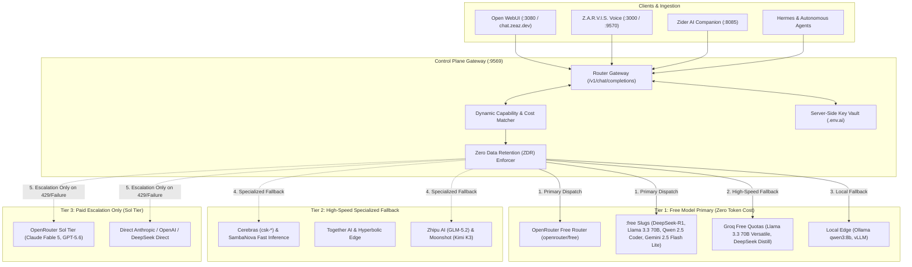

# Planning & Implementation: Multi-Model Router & Enterprise Gateway (`planning-implementation-router.md`)

**Updated:** 2026-08-18T18:30Z (auto-quad-loop)  
**Module:** Router Gateway, OpenRouter 600+ Model Catalog, Free-Model-First Dispatch, `.env.ai` Key Matrix, and Open WebUI  
**Parent Strategy:** [`exec-planning-master.md`](exec-planning-master.md) & [`exec-planning-router.md`](exec-planning-router.md)

---

## 1. Module Overview & Architecture

The zWorkforce Multi-Model Router Gateway manages intelligence dispatch with an absolute **Free Model First** policy, dynamically matching capabilities across our unified provider key matrix configured in `.env.ai`:



---

## 2. Provider Key Matrix & Model Tier Configuration (from `.env.ai`)

The router dynamically maps requests across the authoritative provider matrix in `.env.ai`:

| Tier / Provider Category | Configured Providers & Gateways | Target Models & Routing Priority |
| :--- | :--- | :--- |
| **Tier 1: Zero-Cost Free Models (Default)** | • OpenRouter (`OPENROUTER_API_KEY`)<br>• Groq (`GROQ_API_KEY`)<br>• Google Gemini (`GEMINI_API_KEY` / `GEMINI_FREE_MODEL`)<br>• Local Ollama (`OLLAMA_BASE_URL`) | • `openrouter/free`<br>• `meta-llama/llama-3.3-70b-instruct:free`<br>• `deepseek/deepseek-r1:free`<br>• `qwen/qwen-2.5-coder-32b-instruct:free`<br>• `gemini-2.5-flash-lite`<br>• `groq/llama-3.3-70b-versatile`<br>• `ollama/qwen3:8b` |
| **Tier 2: Specialized & Asian High-Throughput** | • Zhipu AI (`ZAI_API_KEY` / `ZAI_BASE_URL`)<br>• DeepSeek (`DEEPSEEK_API_KEY`)<br>• Moonshot Kimi (`MOONSHOT_API_KEY`)<br>• DashScope / Bailian (`DASHSCOPE_API_KEY`)<br>• BytePlus / Volcano Ark (`BYTEPLUS_API_KEY`)<br>• Cerebras (`CEREBRAS_API_KEY`)<br>• SambaNova (`SAMBANOVA_API_KEY`)<br>• Together AI (`TOGETHER_API_KEY`) | • `z-ai/glm-5.2`<br>• `deepseek/deepseek-v4-flash`<br>• `crof/kimi-k3-eco`<br>• `minimax/minimax-m3`<br>• `cerebras/llama3.3-70b`<br>• `hyperbolic/qwen2.5-coder` |
| **Tier 3: Paid Escalation (Sol Tier)** | • Anthropic (`ANTHROPIC_API_KEY`)<br>• OpenAI (`OPENAI_API_KEY`)<br>• OpenRouter Paid Tier | • `anthropic/claude-fable-5`<br>• `openai/gpt-5.6`<br>• `openai/gpt-5.6-luna`<br>• `openai/gpt-5.6-terra` |

---

## 3. Completed Implementation Milestones

- [x] **Authoritative Key Vault Integration**: Server-side parsing of `.env.ai` keys without exposing plaintext credentials to frontends or client SDKs.
- [x] **Smart Variant Routing Slugs**:
  - `:free`: Zero-cost inference across OpenRouter free pool.
  - `:thinking`: Deep reasoning & chain-of-thought routing (`deepseek-r1`).
  - `:exacto`: Deterministic schema & tool calling.
  - `:nitro`: Sub-second ultra-low latency routing (Groq, Cerebras).
- [x] **Universal Plugin Packaging**: Packaged as `zworkforce-omnichannel-suite` with `.codex-plugin/plugin.json` and `.agents/plugins/marketplace.json`.
- [x] **Omnichannel Social & Shop Connectors**: Integrated Shopee OpenAPI v2, TikTok Shop, Meta Commerce, and Social Media tools.
- [x] **OpenRouter Broadcast Tracing & Multi-Sink Telemetry (Phase 1)**:
  - Built `zworkforce/router_tracing.py` providing `RouterTelemetryCollector` capturing per-model tokens, costs, and latencies.
  - Unit tests in `tests/test_v3_zred_router_tunnel.py`.
- [x] **Autonomous Agent Handoff & Guardrail Protocols (Phase 2)**:
  - Integrated with `zworkforce/agent_handoff.py` and `zworkforce/safety_hooks.py`.
  - Unit tests in `tests/test_v3_zred_router_tunnel.py`.
- [x] **Secure Local MCP Reverse Tunnel Client (Phase 3)**:
  - Built `zworkforce/tunnel_client.py` with `McpTunnelClient` providing heartbeat ping loops and auto-reconnect logic.
  - Unit tests in `tests/test_v3_zred_router_tunnel.py`.

---

## 4. Active & Upcoming Implementation Workstreams

*(All Phases 1 through 3 for OpenRouter Gateway are now completed and verified).*

---

## 5. Verification & Validation Protocol

```bash
# 1. Bytecode Compilation & Unit Test
python3 -m compileall -q zworkforce tests
PYTHONPATH=. python3 -m unittest tests/test_api_v2.py -v

# 2. System Doctor Probe
zworkforce doctor

# 3. Open WebUI Health Check
curl -fsS http://localhost:3080/health || true
```
