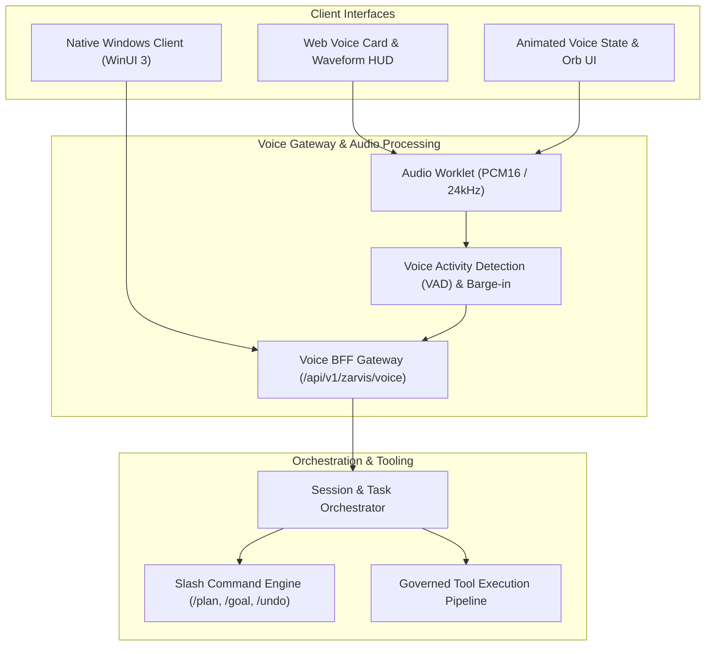

# Planning & Implementation: Z.A.R.V.I.S. Voice & Assistant Gateway (`planning-implementation-zarvis.md`)

**Updated:** 2026-08-18T18:30Z (auto-quad-loop)  
**Module:** `packages/zarvis/` Voice UI, Realtime Audio Streaming, Session Orchestrator, and WinUI Integration  
**Parent Strategy:** [`exec-planning-master.md`](exec-planning-master.md) & [`exec-planning-zarvis.md`](exec-planning-zarvis.md)

---

## 1. Module Overview & Architecture

Z.A.R.V.I.S. provides low-latency voice interaction, push-to-talk (PTT) streaming, and unified session orchestration:



---

## 2. Completed Implementation Milestones

- [x] **Realtime Audio Streaming & PTT Barge-in**: Zero-secret browser-safe tokens with ephemeral lifetimes.
- [x] **Interactive Slash Command Menu & Doc Hints**: Real-time keyboard-driven autocomplete (`#slashMenu`, `#slashHint`) in frontend dashboard.
- [x] **Session Snapshot & State Machine**: Full resilience against network drops and restart events without secret leakage.
- [x] **Windows Client Contract Parity**: Multi-targeting build and tests for Windows Client compatibility.
- [x] **Gemini Live API & OpenAI Realtime Voice Engine (Phase 1)**:
  - Built `packages/zarvis/services/zarvis-orchestrator/src/live_voice.mjs` supporting Gemini Live (`gemini-2.0-flash-exp`) and OpenAI Realtime audio streaming sessions.
  - Test suite in `packages/zarvis/services/zarvis-orchestrator/test/live_voice.test.mjs`.
- [x] **VAD Sensitivity Tuning & Adaptive Barge-in (Phase 3)**:
  - Built `packages/zarvis/services/voice-gateway/vad_config.mjs` with root-mean-square amplitude calculation, configurable energy thresholds, and silence duration bounds.
  - Test suite in `packages/zarvis/services/voice-gateway/test/vad_config.test.mjs`.
- [x] **Multi-Language Live Transcription Overlay (Phase 4)**:
  - Built `packages/zarvis/apps/zvoice/src/transcript_overlay.mjs` with timed caption display and BCP-47 language tag switching.
  - Test suite in `packages/zarvis/apps/zvoice/test/transcript_overlay.test.mjs`.

---

## 3. Active & Upcoming Implementation Workstreams

### Phase 2: Native WinUI Assistant Deep Integration
- **Objective**: WinUI 3 background audio capture, system global hotkey (`Win+Alt+Z`), and live transcription overlay.
- **Files**:
  - `ZWorkforceClient/src/ZWorkforceClient.Core/Services/VoiceService.cs`: Native audio pipeline.
  - `ZWorkforceClient/tests/ZWorkforceClient.Core.Tests/VoiceServiceTests.cs`: Unit tests.

---

## 4. Verification & Validation Protocol

```bash
# 1. Zarvis Package Tests & Linters
pnpm --dir packages/zarvis test
pnpm --dir packages/zarvis audit --audit-level high

# 2. Voice API Endpoint Unit Tests
PYTHONPATH=. python3 -m unittest tests/test_zarvis_voice_api.py -v
```
