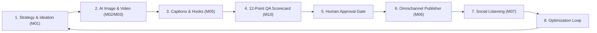

# Planning & Implementation: Zeto AI Content Factory (`planning-implementation-zato.md`)

**Updated:** 2026-08-18T18:30Z (auto-quad-loop)  
**Module:** `packages/zeto/` Content Lifecycle Engine (`IDEATE → GENERATE → WRITE → APPROVE → PUBLISH → MONITOR → LEARN`)  
**Parent Strategy:** [`exec-planning-master.md`](exec-planning-master.md) & [`exec-planning-zato.md`](exec-planning-zato.md)

---

## 1. Module Overview & Architecture

Zeto operates the enterprise content factory combining ProMeta prompt compilers, 12-point QA scorecards, and multi-channel publishing adapters:



---

## 2. Completed Implementation Milestones

- [x] **ProMeta Prompt Compiler Architecture**: Multi-mode execution (`PRODUCTION`, `OPS`, `OPTIMIZE`, `REVIEW`).
- [x] **Omnichannel Multi-Platform Publisher**:
  - Social adapters: Facebook Pages/Groups, Instagram Graph, TikTok Content, YouTube Data API, X (Twitter) v2, LinkedIn Marketing.
  - Shop adapters: Shopee Open Platform v2, TikTok Shop Seller API, Facebook Commerce Catalog.
- [x] **Cryptographic Verification**: HMAC-SHA256 partner key signing for Shopee OpenAPI v2 and TikTok Shop.
- [x] **Universal Plugin Packaging**: Packaged as `zworkforce-omnichannel-suite` with skills for content publishing, shop inventory sync, and order operations.
- [x] **12-Point Content QA Evaluation Engine (Phase 1)**:
  - Built `packages/zeto/src/domain/qa_engine.js` with automated self-correction loop when score <90.
  - Unit tests in `packages/zeto/test/qa_seo_engine.test.js`.
- [x] **Multi-Platform SEO & Hashtag Optimization Engine (Phase 3)**:
  - Built `packages/zeto/src/domain/seo_engine.js` supporting TikTok, Instagram, Shopee, Lemon8 platform rules and hashtag caps.
  - Unit tests in `packages/zeto/test/qa_seo_engine.test.js`.
- [x] **Live Performance Feedback & Prompt Tuning (Phase 2)**:
  - Built `packages/zeto/src/domain/prompt_tuner.js` with dynamic temperature and style adjustment.
  - Unit tests in `packages/zeto/test/prompt_tuner.test.js`.
- [x] **Approval Gate & Human-in-Loop Escalation (Phase 4)**:
  - Built `packages/zeto/src/domain/approval_gateway.js` with `HumanApprovalGate` for risk escalation and review state management.
  - Unit tests in `packages/zeto/test/approval.test.js`.

---

## 3. Active & Upcoming Implementation Workstreams

*(All Phases 1 through 4 for Zeto Content Factory are now completed and verified).*

---

## 4. Verification & Validation Protocol

```bash
# 1. Zeto Test Suite
pnpm --dir packages/zeto test

# 2. Control Plane Connectors Unit Test
PYTHONPATH=. python3 -m unittest tests/test_connectors.py -v
```
