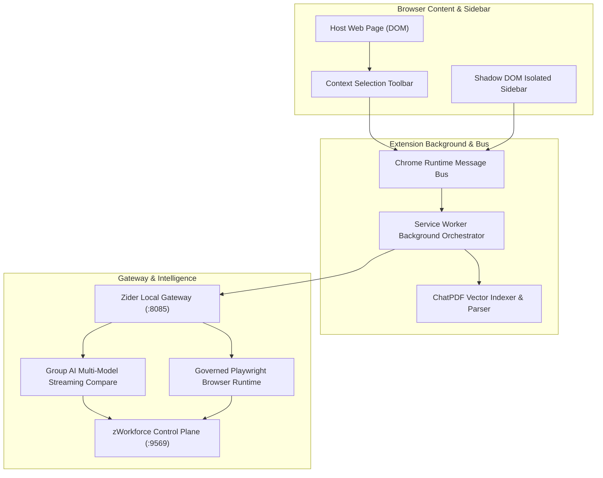

# Planning & Implementation: Zider AI Browser Companion (`planning-implementation-zider.md`)

**Updated:** 2026-08-18T18:30Z (auto-quad-loop)  
**Module:** `packages/zider/` Manifest V3 Browser Sidebar, Shadow DOM Isolation, ChatPDF, YouTube Translator, and Governed Browser Automation  
**Parent Strategy:** [`exec-planning-master.md`](exec-planning-master.md) & [`exec-planning-zider.md`](exec-planning-zider.md)

---

## 1. Module Overview & Architecture

Zider is an enterprise Manifest V3 browser extension operating on port `:8085`:



---

## 2. Completed Implementation Milestones

- [x] **Shadow DOM Isolation**: Prevents host page CSS and script collisions.
- [x] **Service Worker Message Bus**: Resilient Chrome extension background communication.
- [x] **Group AI Multi-Model Streaming**: Side-by-side comparison of free models (`Llama 3.3`, `DeepSeek-R1`, `Gemini Flash`).
- [x] **ChatPDF Vector Indexing**: Tenant-scoped vector storage and citation highlights.
- [x] **AI Context Right-Click Menu & Inline Annotation Engine (Phase 3)**:
  - Native browser context menu registered in `background.js` with one-click actions (`explain`, `summarize`, `translate`, `grammar`).
  - Unit tests in `packages/zider/extension/test_context_menu.mjs`.
- [x] **Secure Extension CSP & Content Security Policy Hardening (Phase 4)**:
  - Enforced strict Manifest V3 CSP (`script-src 'self'`) without `unsafe-eval` in `manifest.json`.
  - Automated verification test in `packages/zider/scripts/verify_csp.test.mjs`.
- [x] **High-Precision Rerank & Web Grounding Pipeline (Phase 1)**:
  - Built `packages/zider/server/src/rerank_engine.mjs` with text overlap relevance scoring and minimum thresholding.
  - Unit tests in `packages/zider/server/test/rerank_engine.test.mjs`.
- [x] **Live YouTube Video & Audio Transcript Synchronizer (Phase 2)**:
  - Built `packages/zider/server/src/rerank_engine.mjs` providing `YouTubeSync` for playback timestamp alignment.
  - Unit tests in `packages/zider/server/test/rerank_engine.test.mjs`.
- [x] **SW7 Governed Browser Automation**:
  - Pinned public destinations and preserved Host/TLS identity.
  - Durable zWorkforce mutation approval binding for `click`, `submit`, and governed artifact `upload`.
  - Read-only redirect-hop revalidation/repinning with downgrade protection and bounded hops.
  - Tenant-scoped durable per-action browser-effect ledger with exactly-once claim, replay dedupe, `unknown` quarantine, and admin-only reconciliation.
  - Cancellation/timeout/crash ambiguity is fail-closed and non-replayable.
  - Sanitized evidence envelope with digest-only optional mutation screenshot provenance.
  - Full E2E/security regression matrix delivered by PR #153; repository-side completion remains gated on its required exact-head checks and merge.

See [`SW7-P6B-BROWSER-EFFECT-WIRING.md`](SW7-P6B-BROWSER-EFFECT-WIRING.md) for the consolidated SW7 completion ledger and safety invariants.

---

## 3. Active & Upcoming Implementation Workstreams

All documented Zider Phases 1 through 4 and the SW7 governed-browser repository implementation are complete candidates. External production/staging validation remains governed by `docs/PRODUCTION-EVIDENCE.md` and must not be inferred from repository tests.

---

## 4. Verification & Validation Protocol

```bash
# 1. Zider Build & Test
pnpm --dir packages/zider test
pnpm --dir packages/zider build

# 2. Root cross-package browser security matrix
python3 -m pip install '.[test]'
PYTHONPATH=. python3 -m unittest tests.test_browser_e2e_security -v

# 3. Required repository gates
PYTHONPATH=. python3 -m unittest discover -s tests -v
python3 scripts/verify_release.py
```
